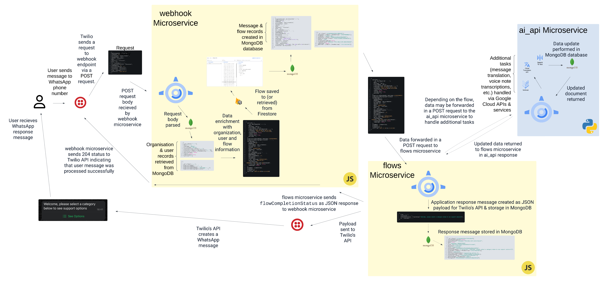

## Introduction

This repository hosts the backend behind some of the WhatsApp automations/tooling created at <a href="https://www.projectalix.com/">Alix</a>, a company founded by Bee Small and Charisma Mehta with the aim to help organisations build stronger connections with customers via easily-accessible technology.

### Key Features

1. **WhatsApp Automation**

- The app enables organizations to define and execute complex workflows via WhatsApp, automating multi-step processes like customer interactions, outreach, notifications and feedback collection

2. **Voice-message processing**

- Using Google Cloud's Speech-to-Text API, the app can process audio inputs, transcribe them into text, and store results in cloud services like Google Cloud Storage or export to a file.

3. **AI-Powered Enhancements**

- Google Cloud's Translation API enables translation of WhatsApp messages ensure accessibility for diverse customers

### Technical Overview

The application is powered by three microservices, each hosted on Google Cloud Platform (GCP) using Google App Engine as a hosting platform for production.

**Webhook Microservice (./webhook)**:

- Handles incoming messages, integrating with Twilio's API.
- [Webhook Microservice directory/code](./webhook/)

**Flows Microservice (./flows)**

- Handles logic of WhatsApp automations and sending of WhatsApp messages back to the user
- [Flows Microservice directory/code](./flows/)

**AI Microservice (./ai_api)**:

- Integrates Google Cloud APIs & services for natural language processing, transcription, and intelligent data handling.
- [AI Microservice directory/code](./ai_api/)

**Simplified Architecture/Data Flow Diagram**

<a href="https://marred-cod-3bd.notion.site/WhatsApp-Docs-12fb464425b0804f98e9ce2eaf0ce40e?pvs=4">More technical details/documentation can be found on this Notion site</a>
